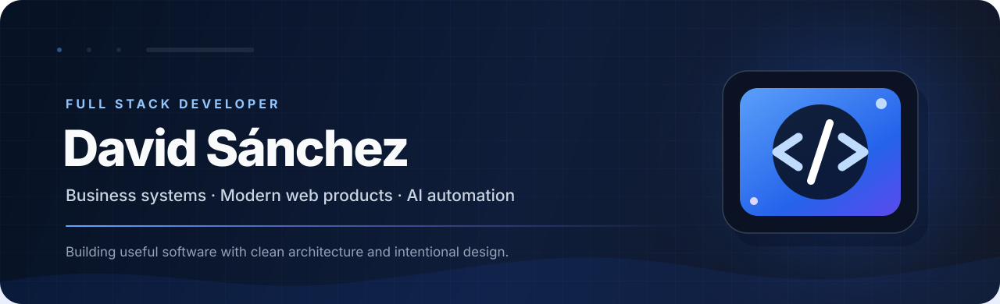

<picture>
  <source media="(prefers-color-scheme: dark)" srcset="./assets/header-dark.svg">
  <source media="(prefers-color-scheme: light)" srcset="./assets/header-light.svg">
  
</picture>

<div align="center">

[](http://davdev.me)
[](mailto:davidantsanchez2@gmail.com)
[](https://github.com/davidsanchez0440)

</div>

## About me

I'm **David Sánchez**, a Full Stack Developer focused on building business software, internal platforms and digital products that combine solid engineering with polished user experiences.

I enjoy turning complex workflows into clear, practical systems: administrative dashboards, ERP/POS tools, medical platforms, automation solutions, API integrations and data-driven applications.

- 💼 Frontend Developer at **Quantech**
- 🧩 Building **OrbentuX**, a business software initiative for small and medium-sized companies
- 🤖 Exploring AI-assisted workflows, customer-service automation and intelligent integrations
- 🎯 Focused on clean interfaces, maintainable architecture and software that solves real operational problems
- 📍 Based in the Dominican Republic

> I don't build software just to make it run. I build it to make work simpler, faster and better.

## What I build

| Business systems | Product experiences | Automation & integrations |
| :--- | :--- | :--- |
| ERP/POS workflows, inventory, billing, roles, permissions and operational dashboards. | Responsive web applications with clear navigation, thoughtful interactions and consistent visual systems. | APIs, webhooks, AI-assisted support, process automation and connections between business tools. |

## Selected work

| Project | What it solves | Focus |
| :--- | :--- | :--- |
| **OrbentuX** | Centralizes day-to-day management for small and medium-sized businesses through practical operational modules. | Business software, ERP/POS, automation |
| **MyDoc** | Connects platform administration, clinics, medical professionals, reception workflows and patients in one role-based ecosystem. | Health platform, dashboards, workflows |
| **Market Monitor / Risk Intelligence** | Brings together market data, business intelligence and risk-oriented interfaces for faster analysis. | Next.js, Power BI, Python, Azure |
| **Transport Management System** | Organizes buses, routes, drivers, users and scheduled trips from an administrative platform. | React, Express, SQL Server |
| **AI Customer-Service Integrations** | Automates first-line assistance, data collection and handoff between AI services and support platforms. | Node.js, webhooks, AI APIs |
| **Custom Business Platforms** | Digitizes appointments, restaurant operations, e-commerce, file sharing and internal processes. | Full stack development, UX, APIs |

## Technology stack

<div align="center">

### Frontend


### Backend


### Data, cloud & tools


</div>

## How I work

```ts
const david = {
  role: "Full Stack Developer",
  builds: ["business systems", "web platforms", "automation", "integrations"],
  priorities: ["useful UX", "clean code", "scalable architecture", "real impact"],
  mindset: "Understand the operation first, then build the right solution."
};
```

## Contribution activity

<picture>
  <source media="(prefers-color-scheme: dark)" srcset="./assets/github-contribution-grid-snake-dark.svg">
  <source media="(prefers-color-scheme: light)" srcset="./assets/github-contribution-grid-snake.svg">
  
</picture>

<sub>The animation is generated automatically from this profile's real GitHub contribution graph.</sub>

## Let's connect

I'm open to collaborating on business software, modern web platforms, automation projects and products where technology can simplify real-world operations.

<div align="center">

[](http://davdev.me)
[](mailto:davidantsanchez2@gmail.com)

<br>

**Build with purpose. Design with clarity. Improve what matters.**

</div>
